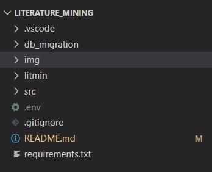
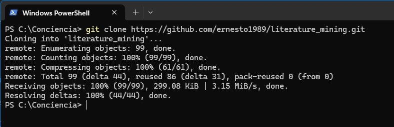
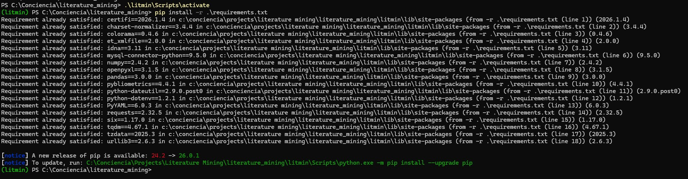

# Literature Mining con Scopus

Autor: Ernesto Cantú Valle
Fecha de Inicio: 27 enero del 2025

Referencias y repositorio base:
- https://www.youtube.com/watch?v=RtEzw4vYN0I
- https://github.com/computron/pybliometrics_ml


Objetivo:

1. Acceder a la API de Scopus para buscar y generar datos de textos científicos.
2. Crear una Base de Datos que permita realizar la analítica necesaria para conocer al respecto de investigación de frontera en el tema de tesis.
3. Descargar y generar una biblioteca de lectura de papers como referencia de mi investigación.


----------------------------------------------------------------------------------------------------------------------------------

## Qué contiene este repositorio



1. db_migration/ddl.sql - El archivo ddl donde se encuentra la estructura de la base de datos requerida. 
2. litmin - Carpeta del ambiente virtual de python.
3. src - Aquí se encuentran todos los scripts requeridos para la ejecución del proyecto.
4. `.env` - Mi archivo de variables de entorno. Aquí dejo las credenciales de mi server de base de datos. Deberás incluir tus propias variables:
    - `MYSQL_HOST`
    - `MYSQL_PORT`
    - `MYSQL_USER`
    - `MYSQL_PASSWORD`
    - `MYSQL_DATABASE` — `scopus_db`
5. requirements.txt - Archivo de requerimientos de Python


## ¿Cómo iniciar? 

**1. Descarga el repositorio**

Descarga el repositorio a una carpeta local.

```powershell
> git clone https://github.com/ernesto1989/literature_mining.git
```




**2. Inicia el ambiente virtual e instala los requerimientos de python**

```powershell
> cd .\literature_mining\
> .\litmin\Scripts\activate
> pip install -r requirements.tx
```




**3. Corre el proyecto, utilizando los argumentos de entrada**

Una vez instalados los requerimientos, puedes correr desde la terminal el proyecto.

```powershell
> python src/main.py --keywords "natural language processing" "machine learning" --year-from 2020 --year-to 2025
```
